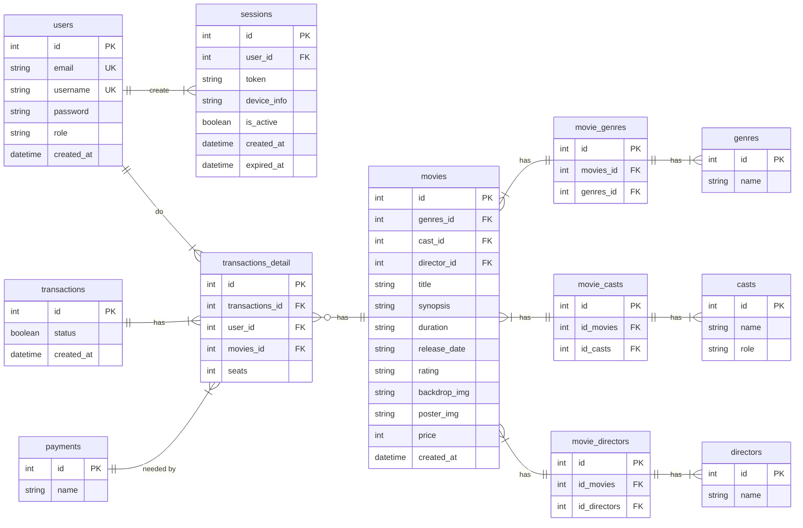

-- Active: 1750218772421@@127.0.0.1@5432@postgres

# ERD: Tickitz

<!--
1. Register
   - id langsung digenerate
   - ketika user register data email, username dan password disimpen di tabel users
   - email, username , dan password harus UNIQUE
   - password harus di hash dulu sebelum masuk
   - role default (user) langsung diberikan
   - is_active masih false
   - created_at ditrigger
2. Login
   - mencocokan input email dan password di tabel users.
   - cocok? atribut is_active ubah ke true
   - token di generate
   - created_at & expired_at di generate
   - device info digenerate
   - user_id ngambil dari atribut id ditabel users
3. Logout
   - is_active diubah jadi false
4. Reset Password
   - user request reset_token
   - created_at dan expired_at digenerate
   - user udah pake token, is_used ubah ke true
 -->
