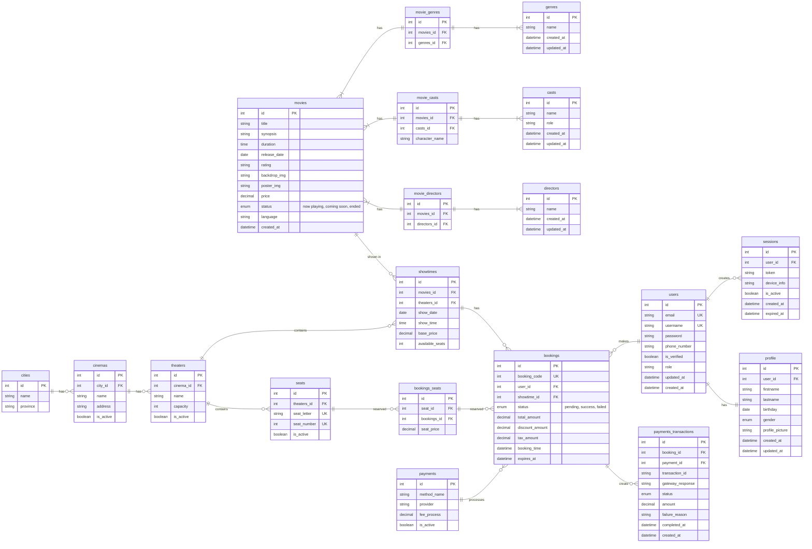

# ERD: Cinemax

```mermaid

erDiagram
    direction LR

    users ||--o{ sessions :"creates"
    users ||--|| profile : "has"

    movie_genres||--|{ genres: "has"
    movies }|--|| movie_genres: "has"
    movie_casts||--|{ casts: "has"
    movies }|--|| movie_casts: "has"
    movies }|--|| movie_directors :  "has"
    movie_directors||--|{ directors: "has"
    movies ||--o{ showtimes: "shown in"

    bookings }o--||users : "makes"
    showtimes ||--o{ bookings : "has"
    seats ||--o{ bookings_seats : "reserved"
    bookings_seats ||--o{ bookings : "reserved"
    payments ||--o{ bookings : "processes"
    bookings ||--o{ payments_transactions : "create"

    cities ||--o{ cinemas : "has"
    cinemas ||--o{ theaters : "has"
    theaters ||--o{ seats : "contains"
    theaters ||--o{ showtimes : "contains"

    users {
        int         id            PK
        string      email         UK
        string      username      UK
        string      password
        string      phone_number
        boolean     is_verified
        string      role
        datetime    updated_at
        datetime    created_at
    }

    sessions {
        int       id            PK
        int       user_id       FK
        string    token
        string    device_info
        boolean   is_active
        datetime  created_at
        datetime  expired_at
    }

    profile {
        int       id            PK
        int       user_id       FK
        string    firstname
        string    lastname
        date      birthday
        enum      gender
        string    profile_picture
        datetime  created_at
        datetime  updated_at
    }

    movies {
        int         id              PK
        string      title
        string      synopsis
        time        duration
        date        release_date
        string      rating
        string      backdrop_img
        string      poster_img
        decimal     price
        enum        status          "now playing, coming soon, ended"
        string      language
        datetime    created_at
    }

    movie_casts{
        int     id              PK
        int     movies_id       FK
        int     casts_id        FK
        string  character_name
    }
    casts {
        int       id            PK
        string    name
        string    role
        datetime  created_at
        datetime  updated_at
    }

    movie_directors{
        int    id              PK
        int    movies_id       FK
        int    directors_id    FK
    }
    directors {
        int       id           PK
        string    name
        datetime  created_at
        datetime  updated_at
    }

    movie_genres{
        int    id           PK
        int    movies_id    FK
        int    genres_id    FK
    }
    genres {
        int       id        PK
        string    name
        datetime  created_at
        datetime  updated_at
    }

    cities {
        int id  PK
        string  name
        string  province
    }

    cinemas {
        int     id          PK
        int     city_id     FK
        string  name
        string  address
        boolean is_active
    }

    theaters {
        int     id          PK
        int     cinema_id   FK
        string  name
        int     capacity
        boolean is_active
    }

    showtimes {
        int     id              PK
        int     movies_id        FK
        int     theaters_id      FK
        date    show_date
        time    show_time
        decimal base_price
        int     available_seats
    }

    seats {
        int     id          PK
        int     theaters_id  FK
        string  seat_letter UK
        int     seat_number UK
        boolean is_active
    }

    bookings_seats {
        int     id              PK
        int     seat_id         FK
        int     bookings_id     FK
        decimal seat_price
    }

    bookings {
        int         id               PK
        int         booking_code     UK
        int         user_id          FK
        int         showtime_id      FK
        enum        status           "pending, success, failed"
        decimal     total_amount
        decimal     discount_amount
        decimal     tax_amount
        datetime    booking_time
        datetime    expires_at
    }

    payments {
        int     id              PK
        string  method_name
        string  provider
        decimal fee_process
        boolean is_active
    }

    payments_transactions {
        int      id              PK
        int      booking_id      FK
        int      payment_id      FK
        string   transaction_id
        string   gateway_response 
        enum     status
        decimal  amount
        string   failure_reason
        datetime completed_at
        datetime created_at
    }
```
